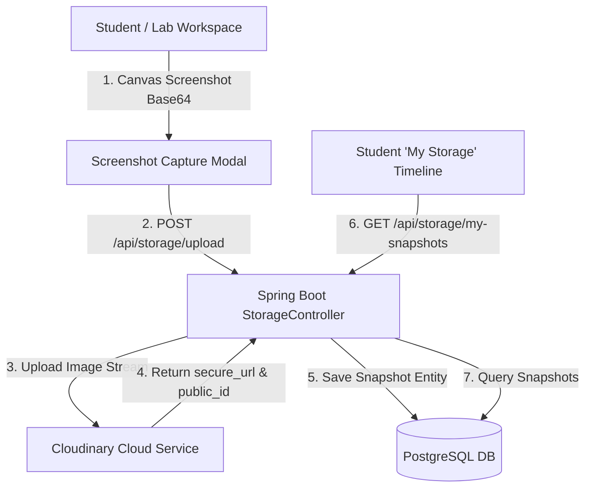

# Implementation Plan: Lab Catalog Database & Student Screenshot "My Storage"

**Mode:** --hard
**Status:** COMPLETED
**Risk:** high-risk — introduces PostgreSQL schema additions (`labs`, `student_lab_snapshots`), external Cloudinary API integration, and user storage REST endpoints.
**Spec:** [spec.md](file:///d:/6_OJT/EduLab/plans/lab-db-storage/spec.md)
**Report:** [260911-lab-db-storage-brainstorm.md](file:///d:/6_OJT/EduLab/plans/reports/260911-lab-db-storage-brainstorm.md)

---

## Session Notes
<!-- Updated by cook automatically — do not edit manually -->

**Last active:** 2026-09-11 11:49
**Phase in progress:** All phases complete
**Status:** All 4 phases implemented and verified passing.

### Decisions made this session
- Implemented Server Proxy upload via Spring Boot `/api/storage/upload` endpoint for Cloudinary integration.
- Stored Lab Metadata in PostgreSQL `labs` table including `difficulty` field (`EASY`, `MEDIUM`, `HARD`).
- Created Student "My Storage" Timeline page (`/student/storage`) with date grouping, difficulty badges, and Lightbox preview.

### Next immediate action
Task complete. Ready for user verification.

---

## Architecture Overview

---

## Phases Overview

- [x] **[Phase 1: Database Entities & Repositories](file:///d:/6_OJT/EduLab/plans/lab-db-storage/phase-01-database-entities-and-repositories.md)**
- [x] **[Phase 2: Cloudinary Service & REST Controller API](file:///d:/6_OJT/EduLab/plans/lab-db-storage/phase-02-cloudinary-service-and-rest-api.md)**
- [x] **[Phase 3: Frontend Screenshot Capture & Confirmation Modal](file:///d:/6_OJT/EduLab/plans/lab-db-storage/phase-03-frontend-screenshot-capture-modal.md)**
- [x] **[Phase 4: Frontend Student "My Storage" Timeline UI](file:///d:/6_OJT/EduLab/plans/lab-db-storage/phase-04-frontend-my-storage-timeline-ui.md)**
